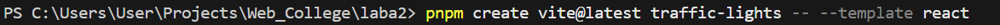
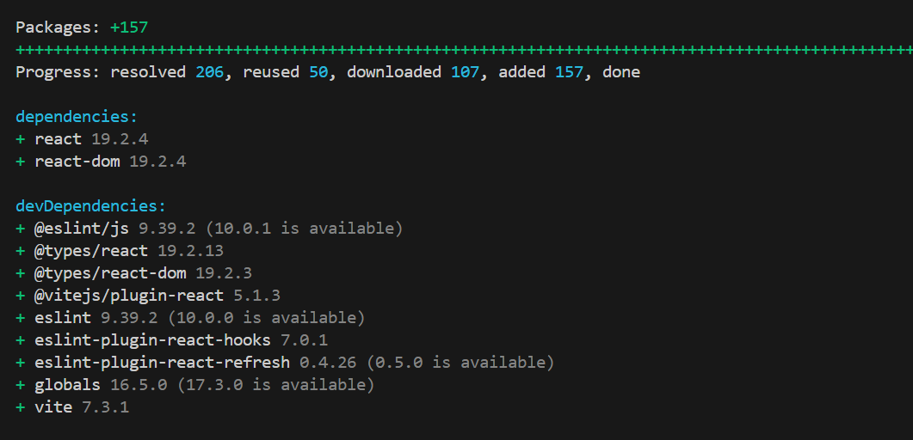
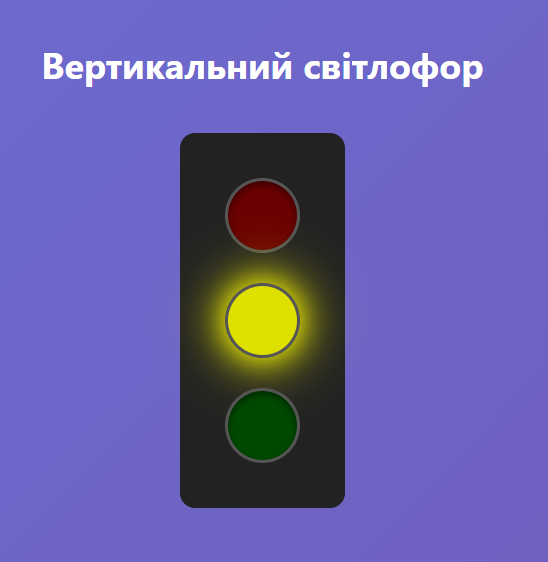
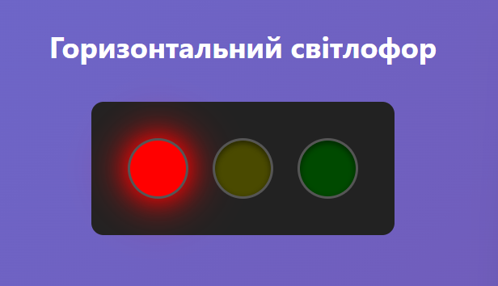
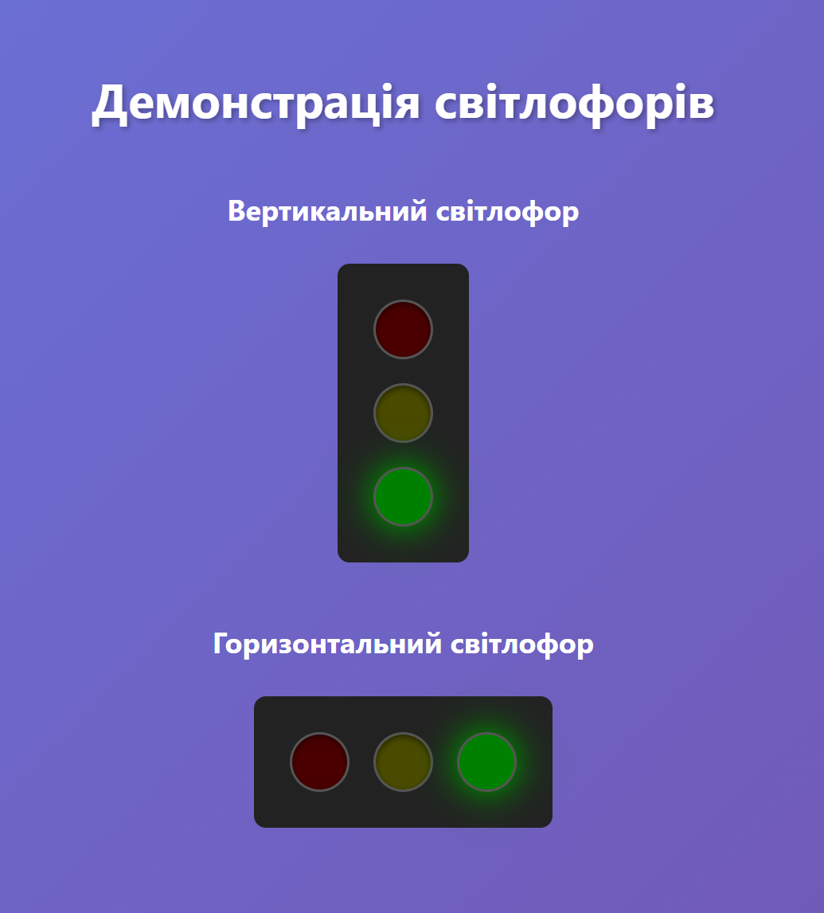
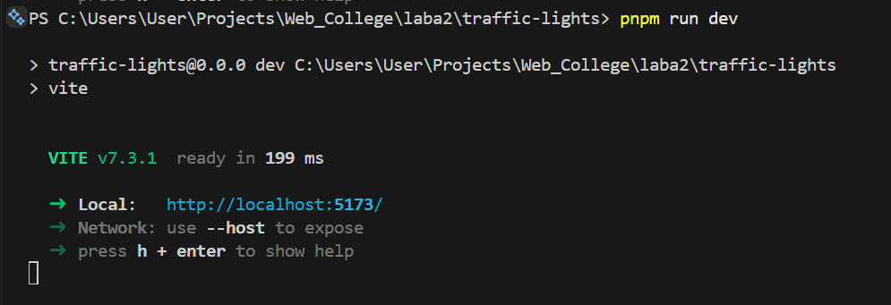

# Звіт з лабораторної роботи №2

**Студент:** Влонга Андрій  
**Група:** 42-КН  
**Дата:** 20/01/2026

---

## Мета роботи

Навчитись створювати React-компоненти, передавати параметри через props, працювати з компонентами у вигляді окремих модулів та оформлювати звіти.

---

## Хід виконання роботи

---

### 1. Створення React-проєкту

```bash
pnpm create vite@latest traffic-lights -- --template react
cd traffic-lights
pnpm install
pnpm install prop-types
```

**Структура проєкту:**

**Скріншоти:**  
<table width="100%" style="border: none;">
  <tr>
    <td align="center" width="50%">
      
      <br/>
      <sub><b>Рис. 1:</b> Створення структури проєкту</sub>
    </td>
    <td align="center" width="50%">
      
      <br/>
      <sub><b>Рис. 2:</b> Встановлення залежностей</sub>
    </td>
  </tr>
</table>

---

### 2. Компонента Light

**Код: `src/components/Light.jsx`**

**Опис:**
- Приймає `tlColor` та `isActive` через props
- Використовує реалістичні темні відтінки для неактивних світел
- Додає ефект свічення для активних світел

---

### 3. Компонента TrafficLights

**Код: `src/components/TrafficLights.jsx`**

**Опис:**
- Використовує хук `useState` для керування активним світлом
- Використовує хук `useEffect` для автоматичного перемикання кожні 5 секунд
- Підтримує вертикальну та горизонтальну орієнтацію

---

### 4. Демонстрація в App

**Код: `src/App.jsx`**

**Скріншоти роботи застосунку:**  
<div align="center">

  
  <p><b>Рисунок 3.</b> Вертикальний світлофор (початковий стан)</p>
  <br/>

  
  <p><b>Рисунок 4.</b> Горизонтальний світлофор з активним зеленим сигналом</p>
  <br/>

  
  <p><b>Рисунок 5.</b> Одночасна робота обох компонентів на головній сторінці</p>

</div>
---

### 5. Запуск проєкту

```bash
cd traffic-lights
pnpm run dev
```

**Скріншот:**  
<div align="center">
  <figure>
    
    <br/>
    <sub><b>Рис. 6:</b> Результат виконання команди <code>npm run dev</code></sub>
  </figure>
</div>

---

## Результати роботи

### Реалізовані функції:

1. **Компонента Light:**
   - Приймає колір через props (`tlColor`)
   - Приймає стан активності (`isActive`)
   - Використовує реалістичні темні відтінки
   - Має ефект свічення для активних світел
   - Використовує PropTypes для валідації

2. **Компонента TrafficLights:**
   - Використовує три компоненти Light
   - Підтримує вертикальну та горизонтальну орієнтацію
   - Автоматичне перемикання кожні 5 секунд
   - Використовує React хуки (useState, useEffect)

3. **Демонстрація в App:**
   - Показано вертикальний світлофор
   - Показано горизонтальний світлофор
   - Відцентрований на всю ширину екрану

---

## Висновки

У ході виконання лабораторної роботи було успішно:
- Створено модульні React-компоненти
- Освоєно роботу з props та PropTypes
- Реалізовано переповикористання компонентів
- Використано React хуки для керування станом
- Додано автоматичне перемикання світлофора з інтервалом
- Створено реалістичний візуальний ефект світлофора

Робота з компонентами дозволяє створювати гнучкі та масштабовані інтерфейси. Використання PropTypes допомагає уникнути помилок при передачі даних між компонентами. Хуки useState та useEffect надають потужні інструменти для керування станом та побічними ефектами.

---

## Посилання

- Репозиторій GitHub: [посилання](https://github.com/AndriyVlonha/Lab2_WEB)
- Документація React: https://react.dev/
- Документація PropTypes: https://www.npmjs.com/package/prop-types
- Документація Vite: https://vitejs.dev/
- React Hooks: https://react.dev/reference/react

---