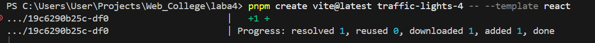
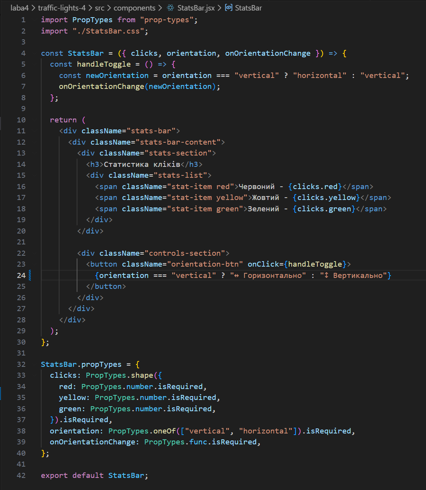
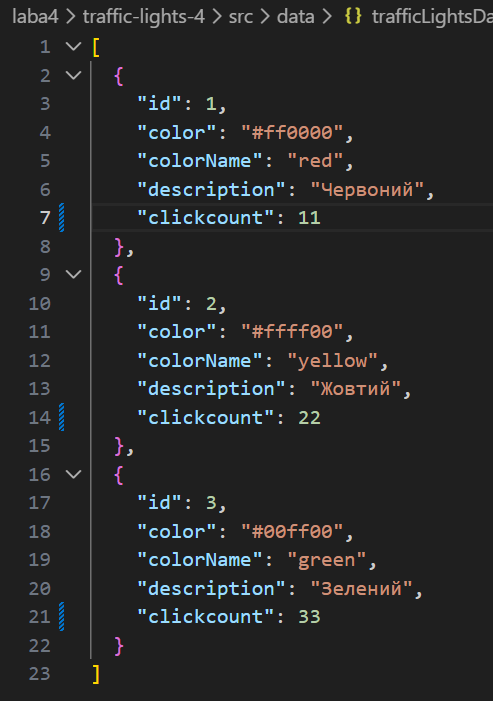
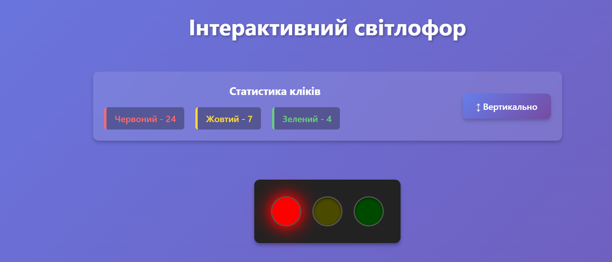
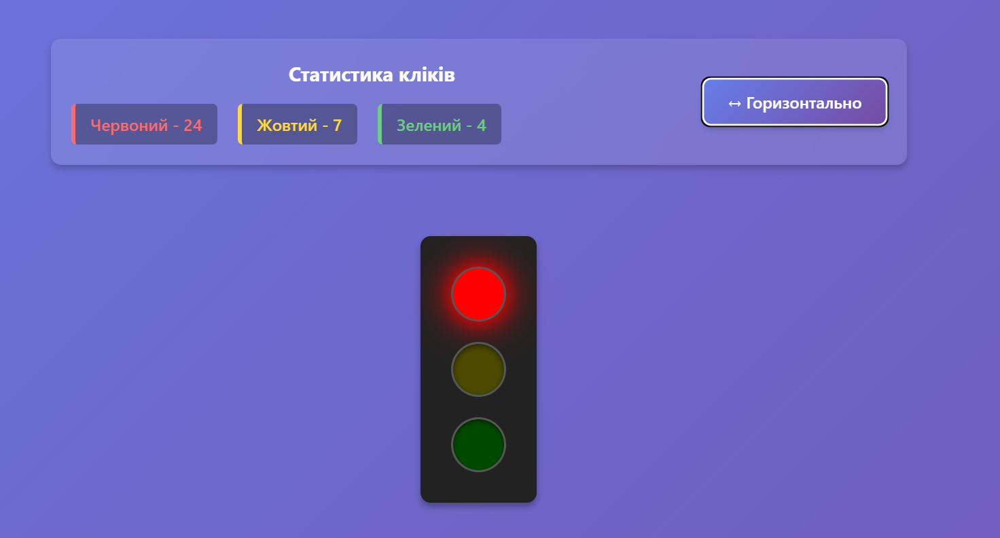
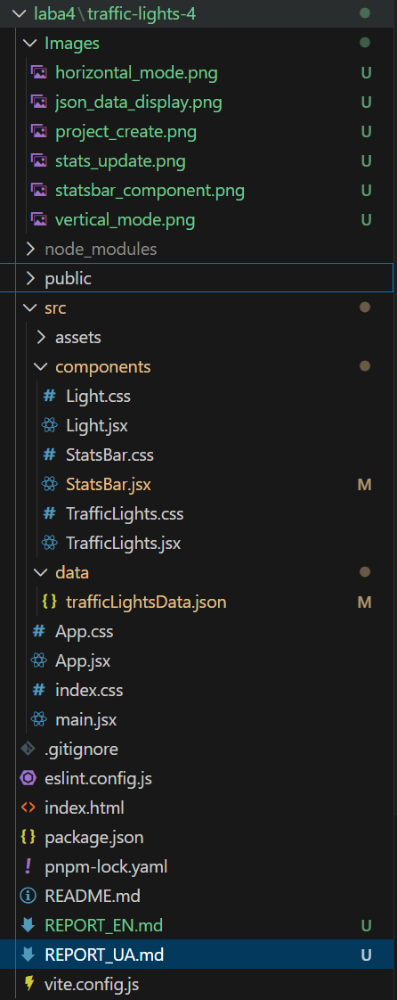
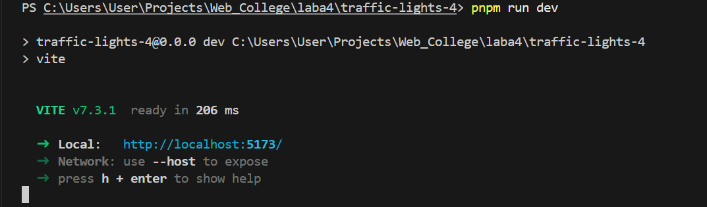

# Звіт з лабораторної роботи №4

**Студент:** Влонга Андрій  
**Група:** 42-КН  
**Дата:** 02/02/2026

---

## Мета роботи

Навчитися працювати з events у React, створити компоненту StatsBar для відображення статистики та керування орієнтацією світлофора. Реалізувати використання JSON бази даних.

---

## Хід виконання роботи

---

### 1. Створення нового проєкту

Створено новий React-проєкт з назвою `traffic-lights-4`:

```bash
pnpm create vite@latest traffic-lights-4 -- --template react
cd traffic-lights-4
pnpm install
pnpm install prop-types
```

**Скріншот:**  
<div align="center">
  <figure>
    
    <br/>
    <sub><b>Рис. 1:</b> Створення нового проєкту traffic-lights-4</sub>
  </figure>
</div>

---

### 2. Перенесення компонентів з попередньої лабораторної

Перенесено компоненти:
- `Light.jsx` та `Light.css` - компонента світла
- `TrafficLights.jsx` та `TrafficLights.css` - компонента світлофора

**Зміни в TrafficLights:**
- Додано prop `onLightClick` для передачі події кліку батьківському компоненту
- Видалено локальний стан `clicks` (перенесено в App)

**Код: `src/components/TrafficLights.jsx`**

**Опис:**
- Компонента тепер використовує callback функцію для повідомлення про кліки
- Стан кліків керується батьківським компонентом (App)

---

### 3. Створення компоненти StatsBar

**Функціонал:**
- Відображення статистики кліків по кольорах
- Кнопка зміни орієнтації світлофора (вертикально/горизонтально)
- Стильний дизайн з використанням CSS

**Код: `src/components/StatsBar.jsx`**

**Опис:**
- Приймає `clicks` - об'єкт зі статистикою кліків
- Приймає `orientation` - поточна орієнтація світлофора
- Приймає `onOrientationChange` - callback для зміни орієнтації
- Відображає статистику з кольоровим форматуванням
- Кнопка динамічно змінює текст та іконку

**Скріншот:**  
<div align="center">
  <figure>
    
    <br/>
    <sub><b>Рис. 2:</b> Компонента StatsBar з статистикою та кнопкою</sub>
  </figure>
</div>

---

### 4. Інтеграція в App компоненту

**Зміни:**
- Додано стан `orientation` для керування орієнтацією
- Додано стан `clicks` для підрахунку кліків
- Реалізовано `handleLightClick` - обробник кліків
- Реалізовано `handleOrientationChange` - обробник зміни орієнтації

**Код: `src/App.jsx`**

**Опис:**
- App керує глобальним станом додатку
- Події передаються через props до дочірніх компонентів
- Централізоване керування станом

---

### 5. Додаткове завдання: JSON база даних

Створено JSON файл з даними світлофорів:

**Файл: `src/data/trafficLightsData.json`**

**Оновлений App.jsx з підтримкою JSON:**

**Опис:**
- Дані завантажуються з JSON файлу при ініціалізації
- Стан `trafficLightsData` містить всю інформацію про кольори
- При кліку оновлюється відповідне поле `clickcount`
- Додано блок візуалізації даних з JSON

**Скріншот:**  
<div align="center">
  <figure>
    
    <br/>
    <sub><b>Рис. 3:</b> Відображення даних з JSON бази</sub>
  </figure>
</div>

---

### 6. Демонстрація роботи

**Скріншоти роботи застосунку:**  

<div align="center">

  
  <p><b>Рисунок 4.</b> Світлофор у вертикальному режимі</p>
  <br/>

  
  <p><b>Рисунок 5.</b> Світлофор у горизонтальному режимі</p>
  <br/>

  
  <p><b>Рисунок 6.</b> Оновлення статистики в реальному часі</p>

</div>

---

### 7. Структура проєкту

**Скріншот:**  
<div align="center">
  <figure>
    
    <br/>
    <sub><b>Рис. 7:</b> Фінальна структура проєкту</sub>
  </figure>
</div>

---

### 8. Запуск проєкту

```bash
cd traffic-lights-4
pnpm run dev
```

**Скріншот:**  
<div align="center">
  <figure>
    
    <br/>
    <sub><b>Рис. 8:</b> Результат виконання команди <code>pnpm run dev</code></sub>
  </figure>
</div>

---

## Результати роботи

### Реалізовані функції:

1. **Компонента StatsBar:**
   - Відображення статистики кліків по кожному кольору
   - Кнопка зміни орієнтації світлофора
   - Динамічне оновлення інтерфейсу
   - Стильний дизайн з градієнтами та ефектами

2. **Керування орієнтацією:**
   - Перемикання між вертикальним та горизонтальним режимами
   - Збереження стану при зміні орієнтації
   - Візуальна індикація поточного режиму

3. **Централізоване керування станом:**
   - Стан `clicks` та `orientation` в App компоненті
   - Передача даних через props
   - Callback функції для подій

4. **JSON база даних (додаткове):**
   - Структуровані дані в JSON форматі
   - Динамічне завантаження даних
   - Оновлення `clickcount` для кожного кольору
   - Візуалізація даних з бази

### Технічні деталі:

- **React Hooks:** useState, useEffect
- **Props:** Передача даних та callback функцій
- **Event Handling:** onClick, onChange
- **State Management:** Централізоване керування станом
- **JSON:** Робота з JSON файлами
- **PropTypes:** Валідація складних об'єктів
- **CSS:** Модульна організація стилів

---

## Висновки

У ході виконання лабораторної роботи було успішно:
- Створено нову компоненту StatsBar для відображення статистики
- Реалізовано можливість зміни орієнтації світлофора
- Освоєно централізоване керування станом у React
- Реалізовано роботу з JSON базою даних
- Покращено архітектуру додатку через винесення стану на верхній рівень
- Використано callback функції для комунікації між компонентами

---

## Посилання

- Репозиторій GitHub: [посилання](https://github.com/AndriyVlonha/Lab4_WEB)
- Документація React State: https://react.dev/learn/state-a-components-memory
- Документація Props: https://react.dev/learn/passing-props-to-a-component
- JSON в JavaScript: https://developer.mozilla.org/en-US/docs/Web/JavaScript/Reference/Global_Objects/JSON
- React Best Practices: https://react.dev/learn/thinking-in-react

---
